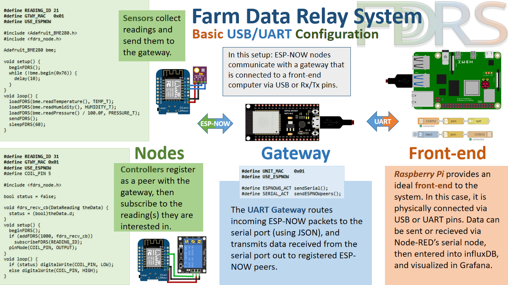
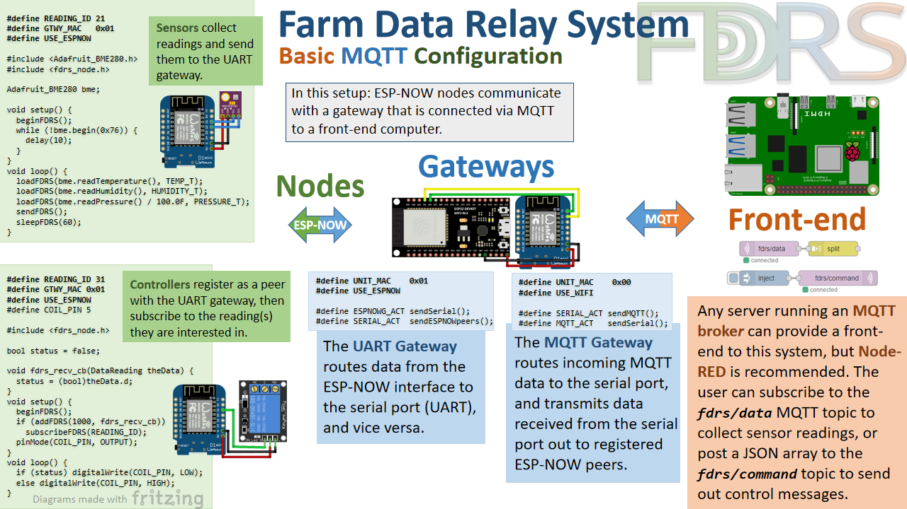

# 
Farm Data Relay System

##### 
[***In loving memory of Gay Holman, an extraordinary woman.***](https://www.facebook.com/CFECI/posts/2967989419953119) #####

Farm Data Relay System is an easy way to communicate with remote IoT devices without relying on WiFi or LoRaWAN. The system establishes a series of low-power, low-cost access points and repeaters that provide light-weight ESP-NOW and LoRa coverage to remote devices. The system can be used to exchange sensor readings or control messages in situations where it would be too difficult or energy-consuming to provide full WiFi/LoRaWAN coverage. While it was designed with farming in mind, FDRS can also be useful in a home, classroom, or research setting. 

Devices are classified into two types: **Gateways** and **User Nodes**. Gateways comprise the infrastructure of the network, moving data in pre-determined directions to provide coverage to all devices. User nodes allow the user to exchange data with the gateways. Each gateway is identified with an 8-bit physical hex address (MAC), while nodes use 16-bit integers to identify datapoints as they move through the system.

If you are having fun with FDRS, **[please consider supporting me](https://www.buymeacoffee.com/TimmB)** so that I can spend more time building it.

## Getting Started
- To install FDRS, download the project folder by clicking the “Clone or download” button and then clicking “Download ZIP”. You should then move it to your Arduino 'libraries' folder to complete the installation.
- After installing, edit the 'src/fdrs_globals.h' file with your WiFi credentials and other global parameters.
- To begin, flash an ESP device with the **1_UART_Gateway.ino** example, and another with the **ESPNOW_Sensor.ino** example. The mocked-up sensor readings will be received by the gateway and relayed to the serial port, where it may be monitored via a terminal.
- If you would like to use MQTT, you can connect a second ESP via the Rx and Tx pins (crossed), and flash it with the **0_MQTT_Gateway.ino** example. If your WiFi and MQTT configurations are correct, data will be published to the topic 'fdrs/data'.

 
Install the libraries that you need:
- [ArduinoJson](https://arduinojson.org/) (mandatory)
- [LoRa library](https://github.com/sandeepmistry/arduino-LoRa) by sandeepmistry (required if using LoRa)
- [PubSubClient](https://github.com/knolleary/pubsubclient/) (required for MQTT Gateways)
- [ArduinoUniqueID](https://github.com/ricaun/ArduinoUniqueID) (required for LoRa nodes)

## User nodes
**[Node Documentation](/extras/Node.md)**

Nodes can be described as *sensors, controllers, or both*:
- A **Sensor node** aggregates data into a packet, then sends it to a gateway via ESP-NOW or LoRa.
- A **Controller node** registers with a gateway to begin receiving data from it, then subscribes to the specific READING_ID(s) that it will listen for data from. When data arrives from an ID the device is subscribed to, a callback function is activated containing the data. Currently this is available only on ESP-NOW devices. 
  
## Gateways
**[Gateway Documentation](extras/Gateway.md)**
  
Gateways are modular and configurable ESP32/8266 devices that can perform a variety of functions. These include collecting, distributing, and relaying data; as well providing a cohesive interface between various wired and wireless protocols. They are generally arranged in a line or star topology, with the gateway closest to the front-end being assigned an address of 0x00.

In its most basic usage, an FDRS gateway is deployed as an access point for remote ESP-NOW and LoRa user nodes. If it receives a packet from an unknown ESP-NOW or LoRa address, the gateway infers that these are sensor readings and passes them downstream towards the front-end. The gateway will send packets originating from the front end to registered peers and repeat them to the next gateway upstream, if applicable. 
 
Gateways can also be configured as simple repeaters; passing data from one neighbor directly to another neighbor or vice versa. This can create a data wormhole that will carry packets upstream or downsteam ad infinitum. You can configure your gateways to share data headed upstream with connected peers, thus providing them with any data being sent from the front-end.
  
## Front-end
 The front-end is the point where the user interacts with FDRS. This could be anything from a microcontroller communicating through UART and displaying data on a screen, to your favorite server/database platform logging the data via MQTT.
 
My recommended method of accessing your data is using a Raspberry Pi linked to an FDRS Gateway device via either MQTT or UART. Node-RED is my favorite platform for accessing/manipulating data on the front-end, and InfluxDB+Grafana is the dream team for storage and visualization. 

## Future Plans
 A few things that I intend to add are:
- Internal timekeeping is the big feature-addition on the horizon. I would like to add a way for FDRS gateways to keep track of time via NTP (on WiFi) or an RTC module, and seamlessly distribute the current time amongst its neighbors automatically. All gateways could then be queried by remote nodes for the current time. Get your T-Watch ready!
- More sensor and controller sketches! If you have designed any open source hardware for ESP32 or 8266, please contact me and I will provide support for your device in this repo.
- Support for several new devices and protocols: ethernet, nRF24L01, 4G LTE, and the E5 LoRa module from Seeed Studio.
- Channel Activity Detection (CAD) and some improvements for LoRa, including controller capabilities.
 
## Thank you
**...very much for checking out my project!** I truly appreciate everyone who has reached out with contributions and assistance, especially those featured in the "Contributors" section. If you have any questions, comments, issues, or suggestions please don't heasitate to contact me at timmbogner@gmail.com or open a discussion here on Github.

Many thanks go to the ever-instructional [**Andreas Spiess**](https://www.youtube.com/channel/UCu7_D0o48KbfhpEohoP7YSQ). His insight and ideas took this project from a roughly-hewn stone to the "[diamond](https://youtu.be/6JI5wZABWmA)" you see today. 

Thanks to [**LilyGo**](https://www.lilygo.cc/) for sending me new [LoRa32 modules](https://www.lilygo.cc/products/lora32-v1-0-lora-868mhz-915mhz) when mine were damaged. Much of this project was [created](https://github.com/timmbogner/Farm-Data-Relay-System/tree/main/examples/Sensor_Examples/LilyGo_HiGrow_32) using [TTGO devices](https://www.lilygo.cc/products/t-higrow), and I highly reccomend their [products](https://www.lilygo.cc/products/lilygo%C2%AE-ttgo-t-display-1-14-inch-lcd-esp32-control-board)!

It is a great honor to have been [featured on **Hackaday**!](https://hackaday.com/2022/07/02/farm-data-relay-system/)
  
[**Random Nerd Tutorials**](https://randomnerdtutorials.com/) was also an indispensable source of ESP knowledge. If you are a beginner and trying to learn more about   microcontrollers, I highly reccomend starting there.
  

Development of this project would not have been possible without the support of my former employer, **Sola Gratia Farm** of **Urbana, IL, USA**.  Sola Gratia is a community-based farm dedicated to growing high-quality produce and sharing it with those in need. Thank you.
  

 #

#
#

#
