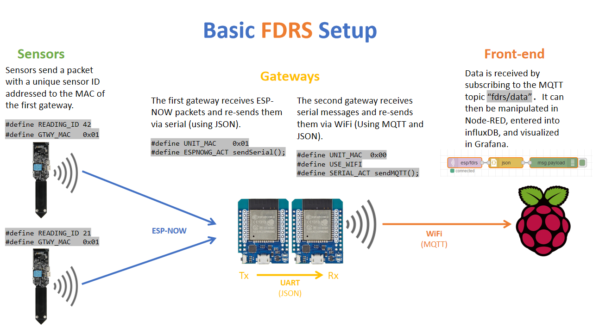
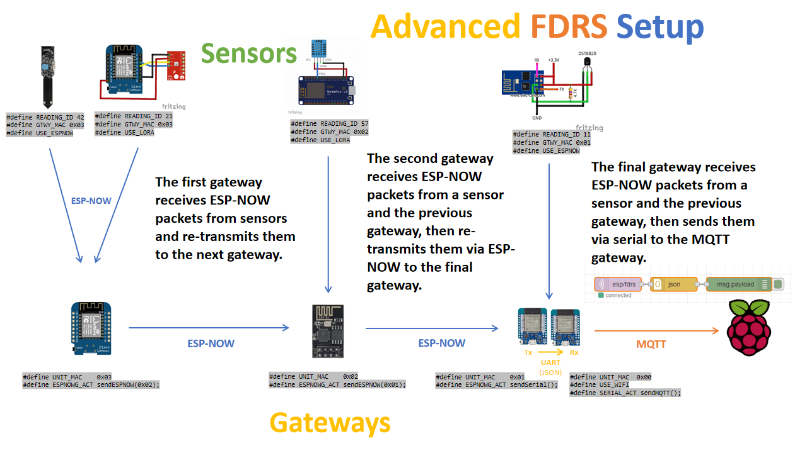
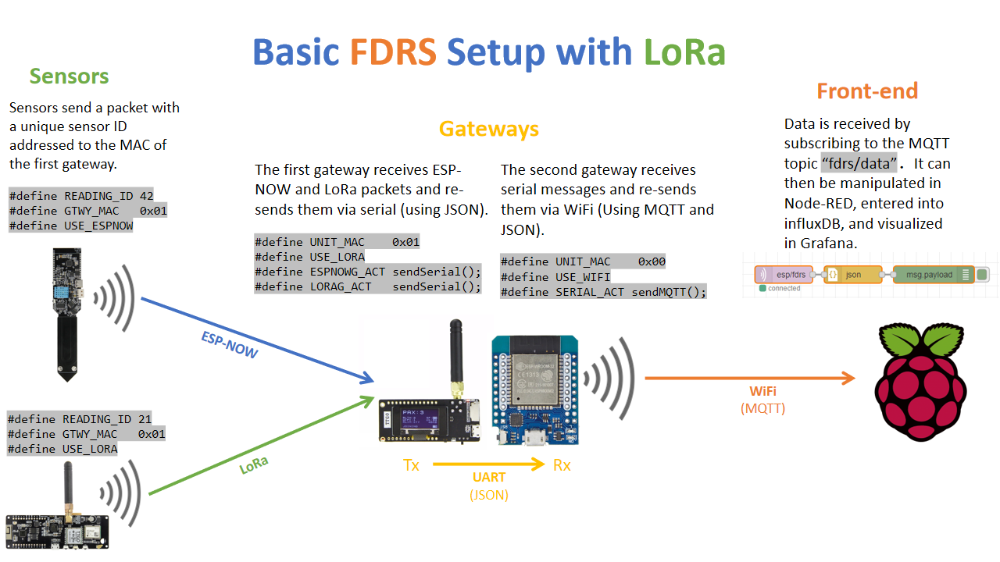
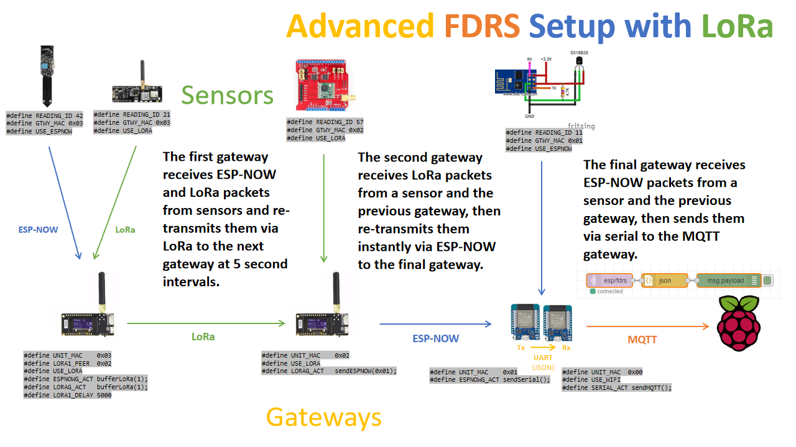

# FDRS Gateway

The FDRS Gateway listens for packets over ESP-NOW, UART, LoRa, and/or MQTT, then retransmits the packets over these interfaces using rules defined in the "Routing" section of the configuration file.

A basic FDRS gateway's sketch file (.ino) will look like this:

``` cpp
#include "fdrs_gateway_config.h"
#include <fdrs_gateway.h>

void setup() {
  beginFDRS();
}

void loop() {
  loopFDRS();
}
```

## Addresses
#### ```#define UNIT_MAC 0xNN```
The ESP-NOW and LoRa address of the gateway. This is the address that nodes and other gateways will use to pass data to this device.
#### ```#define ESPNOW_NEIGHBOR_1 0xNN```, ```ESPNOW_NEIGHBOR_2 0xNN```
The addresses of any ESP-NOW repeaters neighboring this gateway.
#### ```#define LORA_NEIGHBOR_1 0xNN```, ```LORA_NEIGHBOR_2 0xNN```
The addresses of any LoRa repeaters neighboring this gateway.
## Interfaces
#### ```#define USE_ESPNOW```
Enables ESP-NOW.

#### ```#define USE_LORA```
Enables LoRa. Ensure your pins are configured correctly.
#### ```#define USE_WIFI```
Enables WiFi for use by MQTT. Do not enable WiFi and ESP-NOW simultaneously.
#### ```#define USE_ETHERNET```
Enables ethernet to be used by MQTT. 

## Routing
**Events** occur when data arrives at the gateway via its various interfaces. When an event occurs it triggers one or more **actions**, which are functions that re-send the incoming data over the same or different interfaces.

**Example:** In the following configuration, a packet that arrives at the serial port will be sent to the gateway's neighbor #2, and then to all ESP-NOW nodes that are connected:
```
#define SERIAL_ACT sendESPNowNbr(2); sendESPNowPeers();
```
#
### Events

#### ```#define ESPNOWG_ACT ```
Actions that occur when data arrives from an ESP-NOW device that is *not* listed as a neighbor.
#### ```#define LORAG_ACT ```
Actions that occur when data arrives from a LoRa device that is *not* listed as a neighbor.
#### ```#define SERIAL_ACT ```
Actions that occur when JSON data arrives over UART.
#### ```#define MQTT_ACT ```
Actions that occur when JSON data is posted to the MQTT topic defined by ```TOPIC_COMMAND``` in 'src/fdrs_globals.h'.
#### ```#define INTERNAL_ACT ```
Actions that occur when data is entered by a user-defined function. Used for sending the gateway's own voltage or temperature.
#### ```#define ESPNOW1_ACT ``` and ```ESPNOW2_ACT ```
Actions that occur when data arrives from the devices defined by ```ESPNOW_NEIGHBOR_1``` and ```ESPNOW_NEIGHBOR_2```.
#### ```#define LORA1_ACT ``` and ```LORA2_ACT ```
Actions that occur when data arrives from the devices defined by ```LORA_NEIGHBOR_1``` and ```LORA_NEIGHBOR_2```.
#
### Actions
#### ```sendSerial();```
Transmits the data in JSON format via both the debugging terminal as well as a second UART interface. (If available. See below.)
#### ```sendMQTT();```
Posts the data in JSON format to the MQTT topic defined by ```TOPIC_DATA```
#### ```sendESPNowNbr(1 or 2);```
Sends the data to the address defined by ```ESPNOW_NEIGHBOR_1``` or ```ESPNOW_NEIGHBOR_2```
#### ```sendESPNowPeers();```
Sends the data to any ESP-NOW controller node that has registered with this gateway as a peer.
#### ```sendLoRaNbr(1 or 2);```
Sends the data to the address defined by ```LORA_NEIGHBOR_1``` or ```LORA_NEIGHBOR_2```
#### ```broadcastLoRa();```
Broadcasts the data to any LoRa controller node that is listening to this gateway. No registration is needed to pair with a LoRa controller.
#### ```sendESPNow(0xNN);```
Sends the data directly to the ESP-NOW gateway address provided. There is no LoRa equivalent of this function.

#
## LoRa Configuration
#### ```#define RADIOLIB_MODULE cccc```
The name of the RadioLib module being used. Tested modules: SX1276, SX1278, SX1262.
#### ```#define LORA_SS n```
LoRa chip select pin.
#### ```#define LORA_RST n```
LoRa reset pin.
#### ```#define LORA_DIO n```
LoRa DIO pin. This refers to DIO0 on SX127x chips and DIO1 on SX126x chips.
#### ```#define LORA_BUSY n```
For SX126x chips: LoRa BUSY pin. For SX127x: DIO1 pin, or "RADIOLIB_NC" to leave it blank. 
#### ```#define LORA_TXPWR n```
LoRa TX power in dBm.
#### ```#define USE_SX126X```
Enable this if using the SX126x series of LoRa chips.

#### ```#define CUSTOM_SPI```
Enable this to define non-default SPI pins.
#### ```#define LORA_SPI_SCK n```, ```LORA_SPI_MISO n```, ```LORA_SPI_MOSI n```
Custom SPI pin definitions.

#
**LoRa radio parameters are generally configured in the 'src/fdrs_globals.h' file.** The following values may be set in the gateway configuration file if the user wishes to override the global value:

The actual allowed values may vary by chip. Check the datasheet and/or RadioLib documentation.
#
#### ```#define LORA_FREQUENCY n```
LoRa frequency in MHz. Allowed values range from 137.0 MHz to 1020.0 MHz.
#### ```#define LORA_SF n```
LoRa spreading factor. Allowed values range from 6 to 12. 
#### ```#define LORA_BANDWIDTH n```
LoRa bandwidth in kHz. Allowed values are 10.4, 15.6, 20.8, 31.25, 41.7, 62.5, 125, 250 and 500 kHz.
#### ```#define LORA_CR n```
LoRa coding rate denominator. Allowed values range from 5 to 8.
#### ```#define LORA_SYNCWORD n```
LoRa sync word. Can be used to distinguish different networks. Note that 0x34 is reserved for LoRaWAN.
#### ```#define LORA_INTERVAL n```
Interval between LoRa buffer releases. Must be longer than transmission time-on-air.

## WiFi and MQTT Configuration
WiFi and MQTT parameters are generally configured in the 'src/fdrs_globals.h' file. The following values may be set in the gateway configuration file if the user wishes to override the global value:
#### ```#define WIFI_SSID "cccc"``` and ``` WIFI_PASS "cccc"  ```
WiFi credentials
#### ```#define MQTT_ADDR "n.n.n.n"``` or ```MQTT_ADDR "cccc"```
The address of the MQTT server, either the IP address or domain name.
#### ```#define MQTT_PORT n ```
The port of the MQTT server.
#### ```#define MQTT_AUTH ```
Enable this if using MQTT authentication 
#### ```#define MQTT_USER "cccc"``` and ```MQTT_PASS "cccc"```

#
### SSD1306 OLED Display
Built on the [ThingPulse OLED SSD1306 Library](https://github.com/ThingPulse/esp8266-oled-ssd1306)
#### ```#define OLED_HEADER "cccc"```
The message to be displayed at the top of the screen.
#### ```#define OLED_SDA n``` and ```OLED_SCL n```
OLED I²C pins.
#### ```#define OLED_RST n```
OLED reset pin. Use '-1' if not present or known.
#
### Miscellaneous
#### ```#define FDRS_DEBUG```
Enables debugging messages to be sent over the serial port and OLED display.
#### ```#define RXD2 (pin)``` and ```TXD2 (pin)```
Configures a second, data-only UART interface on ESP32. The ESP8266 serial interface is not configurable, and thus these options don't apply.

#### ```#define USE_LR```
Enables ESP-NOW Long-Range mode. Requires ESP32.
## Neighbors
*To-do: Describe neighbors and how to use them to make repeaters.*

## User-Defined Functions
This feature allows the user to send data from the gateway itself. For example: the battery level or ambient temperature at the gateway.

Calling ```scheduleFDRS(function, interval);``` after initializing FDRS will schedule ```function()``` to be called every ```interval``` milliseconds.

Within this function, the user may utilize the same ```loadFDRS()``` and ```sendFDRS()``` commands used by sensors. After the data is sent, it triggers ```INTERNAL_ACT``` where it can be routed to the front-end.

#### ```loadFDRS(float data, uint8_t type, uint16_t id);```
Loads some data into the current packet. 'data' is a float, 'type' is the data type, and 'id' is the DataReading id.
#### ```sendFDRS();```
Sends the current packet using actions defined by ```INTERNAL_ACT```. Does not return any value.

**Example:**
``` cpp
#define GTWY_READING_ID 42
#define INTERVAL_SECONDS 60

#include "fdrs_gateway_config.h"
#include <fdrs_gateway.h>
#include <your_bms.h>

void sendReading() {
  float v = bms.readVoltage();
  loadFDRS(v, VOLTAGE_T, GTWY_READING_ID);
  sendFDRS();
}

void setup() {
  beginFDRS();
  scheduleFDRS(sendReading, INTERVAL_SECONDS * 1000);
}

void loop() {
  loopFDRS();
}
```

#







